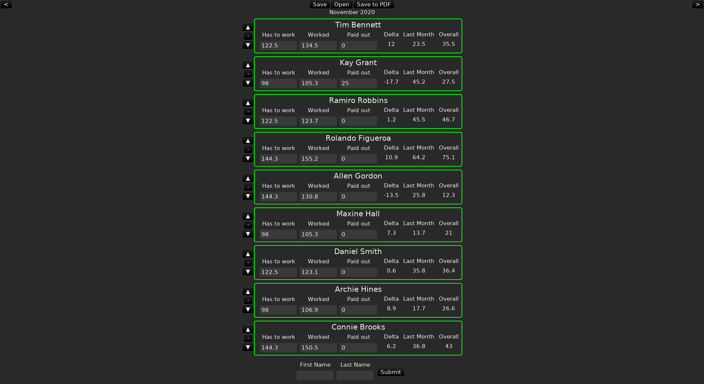

# work_calc
A program to calculate how much your workers have worked, had to worked and calculating overtime

#Screenshot

 # Usage
 Firt of all you have to create your workers. You have to do this by entering the name of the worker at the botton of the list and clicking submit. 
 You will notice the list will be filled with boxes containing the name of your workers. 
 In these boxes you can also put how much your workers had to work, had worked and paid out. 
 The program will then calculate the delta and using the last month the overall overtime of your workers.
 After having finished this month you can go to the next month using the top right arrow. You can also go back using the top left arrow.
 You will notice that all your workers also have new boxes in this month to be filled out.
 
 You will also notice arrows and a minus next to each box. This is for moving the worker around the list and removing the worker from the list.
 
 Finally you will also notice "Save", "Open", "Save to PDF" in the header. 
 These will save your data as a .ron file, open your .ron files or write the data to a .pdf you can print afterwards.
 
 # Future features (maybe)
 * Opening the last file
 * Support for opening .ron files from file explorer
 
 # Disclaimer
 As druid, the GUI-Framework this program uses, is still in development, this program probably also has to be seen as "under development".
